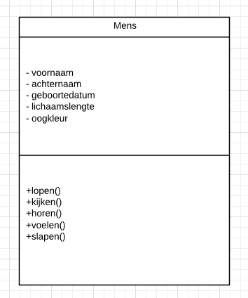
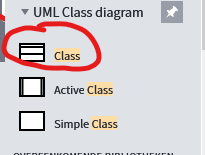
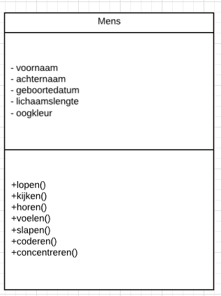

# Ontwerpen 2

## UML-TAAK01

### Lucidcharts en UML

Zoals eerder werd vermeld maken we in de wereld van Software Ontwikkeling gebruik van 2 soorten manieren om de blauwdruk weer te geven, met een schematische tekening [UML](https://nl.wikipedia.org/wiki/Unified_Modeling_Language) en in code (OOP).

Een Software Ontwikkelaar zet meestal zijn ideeen eerts op papier. Vandaar dat je deze technische schrijfwijze leert met deze module

Om een Class met eigenschappen en methodes (properties en methods) op papier te zetten maken we gebruik van UML. We maken een Class Diagram:

> - Je ziet de naam van de Class bovenin staan.

### Leerdoelen

> 1. [ ] Ik maak met behulp van UML een Class met properties en methods

### Opdracht

1. Ga naar www.lucidcharts.com en login. (registreer als je dat nog niet gedaan hebt)
2. Zoek met behulp van de zoekfunctie naar "_Class_"

3. Sleep het type _Class_ naar het canvas 
4. Maak nu de Mens Class door de gegevens te wijzigen.
5. Let op dat je de properties bovenin zet en
6. de methods onderin.
7. Check je oplossing met het eindresultaat

### Eindresultaat

### Bronnen
