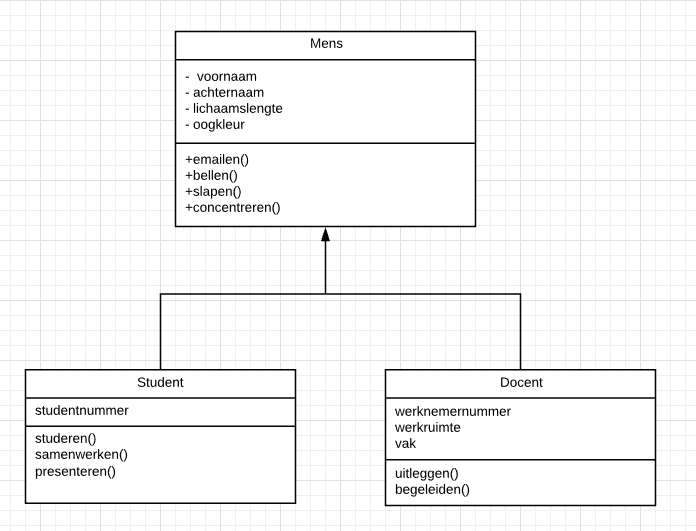

# Ontwerpen 2

## UML-TAAK01

### UML - Overerving (inheritance)

In Object geOrienteerd Programmeren (OOP) kun je het design zo maken dat een bepaald ontwerp (class) eigenschappen (en methodes) __erft__ van een andere class. Dit heet overerving (inheritance). Dit scheelt op de lange termijn werk en moeite. Je hoeft namelijk een eigenschap maar 1x te noteren.

Een voorbeeld

> - Van een Voertuig Class kan een auto gemaakt worden maar ook een brommer, een boot of een helicopter.
> - Anders gezegd: Van de bouwtekening Voertuig kunnen we een brommer, boot of een helicopter maken

Je ziet direct dat de verschillen groot zijn tussen deze Voertuigen, maar er zijn ook eigenschappen (en methodes) die ze allemaal kunnen hebben.

> - Verschillen kunnen zijn: aantal vleugels, aantal wielen, aantal zeilen, vaart vooruit, vaart achteruit, landen.
> - Overeenkomsten kunnen zijn: aantal deuren, kan versnellen, kleur, merk, maximum snelheid, versnellen,

Elk Voertuig heeft een merk-eigenschap en een kleur-eigenschap. Dit zijn twee duidelijke voorbeelden van overeenkomsten.

Hoe werkt dit met UML en OOP?

Stel je maakt een UML (zie taak02) voor een Voertuig. Dan kan je van deze Class een Auto-Object maken. Maar een Auto-Object bestaat niet in de werkelijke wereld. Er bestaat wel een Audi A8. Audi A8 is een object van de Auto-Class en dus niet direct van de Voertuig Class.

We zouden dat als volgt kunnen uitschrijven:

Voertuig Class ---> Auto Class ---> Audi A8 Object

Stel je maakt een Boeing 777 Object en een Boeing 747, dan kun je dat als volgt opschrijven

Voertuig Class ---> Vliegtuig Class ---> Boeing 777 Object
Voertuig Class ---> Vliegtuig Class ---> Boeing 747 Object

#### Voertuig UML

Zo zou een UML eruit kunnen zien

Je ziet bovenaan in de afbeelding dat de Voertuig Class met eigenschappen die de andere Classes ook kunnen hebben.
De eigenschappen _kleur_ en _merk_ worden gebruikt door de andere classes.

De overige Classes erven deze eigenschappen, dit wordt aangegeven met de pijl. Je ziet direct dat Vliegtuig een paar _extra_ eigenschappen heeft. Daarnaast heeft Vliegtuig ook nog een methode die de andere Classes niet heeft: __landen()__. Dit geldt ook voor Boot en Auto.

#### Parent en Child Class

> - Alle eigenschappen en alle methodes erven (over) van Voertuig naar de andere Classes.
> - De Voertuig Class wordt de __parent__ Class genoemd
> - De overige Classes worden __child__ Classes genoemdn

### Leerdoelen

> 1. [ ] Ik maak met behulp van UML een Parent Class met een daarbij behorende Child Class

### Opdracht

1. Ga naar www.lucidcharts.com
2. Maak nu wederom een Mens Class met de volgende eigenschappen: _kleur haar_, _oogkleur_, _lichaamslengte_, _voornaam_, _achternaam_ en de volgende methods: _slapen()_, _concentreren()_, _emailen()_, _bellen()_
3. Maak een Student Class die de gegevens uit de Mens Class erft. Maar een student heeft nog een eigenschap: _studentnummer_, _schoolemail_ en de methode: _studeren()_, _samenwerken()_, _presenteren()_
4. Maak een Docent Class die de gegevens uit de Mens Class erft met daarbij de volgende eigenschappen: _werknemernummer_, _werkruimte_,**** _vak en de volgende methode: _uitleggen_, _begeleiden_

### Eindresultaat

### Bronnen

[UML Class Diagram Tutorial](https://youtu.be/UI6lqHOVHic)
