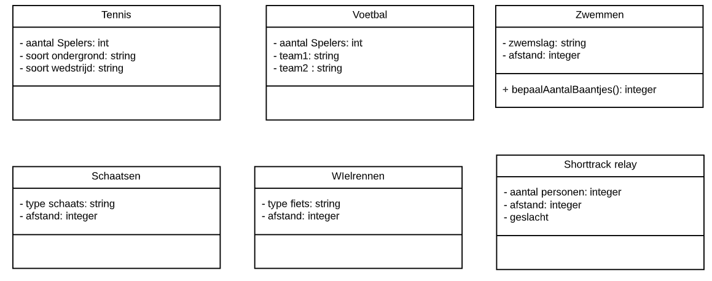

# Ontwerpen 2

## UML-TAAK04

### UML Overerving (inheritance)

In deze taak ga je nog meer UML diagrammen maken. Met de kennis uit de vorge opdrachten is dit een mooie herhalingsopdracht

### Opdracht

Bekijk de bijgeleverde classes. Wat is hebben ze met elkaar gemeen?

1. Maak de parent(s) van deze classes. Zet de eigenschappen op de juiste plek.

> Let op private en public en protected en gebruik de juiste pijl!!
