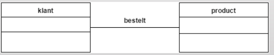
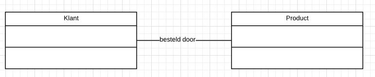
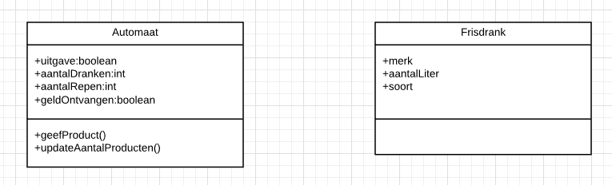

# Ontwerpen 2

## UML-TAAK07

### UML Relaties: ASSOCIATIE

Oke. Je bent hier al helemaal gekomen. Goed gedaan! 

Je hebt kennis genomen van de relatie Parent-Child tussen Classes. 

We gaan het nu hebben over een andere relatie die verschillende Classes (en dus objecten) met elkaar kunnen hebben.

### ASSOCIATIE

Een associatie relatie tussen twee classes betekent simpelweg dat ze iets met elkaar te maken hebben.

> Een klant besteld een product.

Maar andersom had natuurlijk ook heel goed gekunt:

> Een product is besteld door een klant

### Opdracht

1. Bekijk de afbeelding en beschrijf in 1 of 2 woorden de relatie tussen de twee classes

