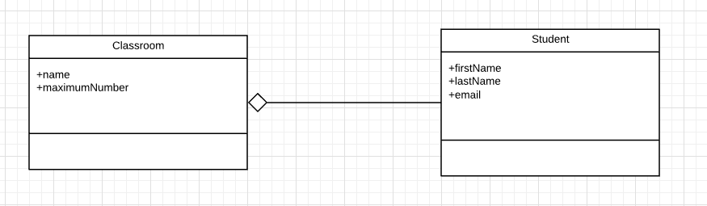

# Ontwerpen 2

## UML-TAAK08

### UML Relaties: AGGREGATIE

Een andere relatie is een Aggregatie. Bij een aggregatie is de relatie erg afhankelijk. Maar wel anders dan bij een parent-child relatie.

Let eens op deze zin:

> Een school is een grote groep vissen van dezelfde soort die dicht op elkaar zwemmen. Het zwemmen in scholen heeft als voordeel dat de groep minder kwetsbaar is voor de aanvallen van roofdieren.

Deze school kan NIET bestaan zonder vissen. Anders gezegd, er zijn vissen nodig om een school te vormen.

Zelfde geldt voor een klas met studenten. Er zijn studenten nodig voor een klas. Anders kan de klas niet bestaan.

Deze afhankelijke relatie noem je een `aggregatie`.

Dit geef je als volgt aan:

### Opdracht

1. Kies twee dieren groepen van [groepen dieren](https://www.dierenfun.com/namen-van-groepen-dieren-kudde-kolonie-school-toom/)
2. Maak van elke groep een class diagram in relatie tot een individueel dier. Uiteraard moet dit een aggregatie worden.
