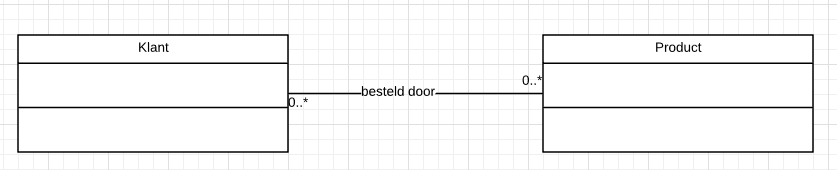

# Ontwerpen 2

## UML-TAAK09

### UML Relaties: MULTIPLICITEIT

Wat nu als je wilt aangeven in welke mate (hoeveel) de relatie inhoud?. Daarvoor gebruik je multipliciteit.

Bijvoorbeeld: Stel het schoolgebouw voor. Daarin heb je 1 aula maar wel meerdere toiletten en meerdere klaslokalen.

### MULTIPLICITEIT

Dit is een moeilijk woord voor een aantal, een getal aangeven wat de relatie inhoud. Een paar voorbeelden:

Een geregistreerde klant koopt nooit iets. 0 producten dus.
Een klant koopt 1 product.
Een klant koop heel veel producten.

In je UML geef je dat dan zo aan:

In tekst kan je dat zo zeggen:

> Een klant bestelt 0 of meerdere producten

De andere kant op kan je ook de relatie aangeven:

In tekst kan je dat zo zeggen:

> Een product kan niet besteld worden en door meerdere klanten besteld worden.

### Opdracht

In de bijgaande class diagram zitten heel veel fouten.

1. Open de png in een teken programma zoals gimp of paint
2. Geef aan waar de fouten zitten.
