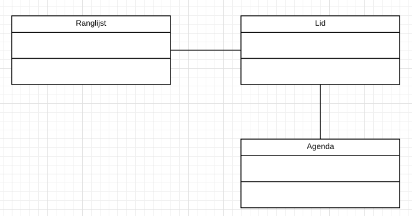

# Ontwerpen 2

## UML-TAAK05

### UML - Tekst vertalen naar UML

We gaan verder met de zelfstandig naamwoorden uit de vorige opdracht.

### Stappenplan

Er zijn 6 stappen die je dient uit te voeren om dit voor elkaar te krijgen:

Elke stap staat in een aparte taak. Deze taak gaan we stap 5 doen.

1. Zoek alle zelfstandig naamwoorden
2. Verwijder dubbele
3. Orden en groepeer
4. Maak klassen
5. `Definieer de relaties (werkwoorden)`
6. Maak methodes en properties

### Stap 5 Definieer de relaties (werkwoorden)

#### Tennis vereniging TopSpin

### Opdracht

1. Lees de tekst hierboven.
2. Geef aan wat de relaties zijn tussen de classes

### Bronnen

[UML Class Diagram Tutorial](https://youtu.be/UI6lqHOVHic)
